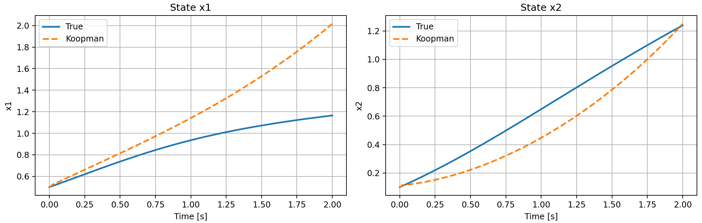

# Using Deep-Koopman and State-Space Modes (SSMs) for World Modeling

This repository contains implementations and experiments for **Koopman-based Robust Model Predictive Control (RMPC)** applied to a **2R2C building thermal model**. The core idea is to approximate nonlinear thermal dynamics with a **linear predictor in a lifted (Koopman) space**, enabling the use of linear MPC techniques while retaining nonlinear system fidelity.

The repository includes **two complementary implementations**:

* A **MATLAB implementation** based on classical Extended Dynamic Mode Decomposition (EDMD) with handcrafted basis functions.
* A **Python implementation** using **Deep Koopman learning**, where the lifting functions are learned via neural networks.

Both implementations follow the same conceptual pipeline and are intended to be compared side-by-side.

---

## Problem Overview

The system of interest is a **2R2C thermal building model**, commonly used to describe indoor temperature dynamics under heating/cooling inputs and environmental disturbances. The dynamics are nonlinear due to bilinear and quadratic terms arising from heat transfer and control interactions.

The control objective is to:

* Accurately predict thermal states over a finite horizon
* Enable robust MPC design using a *linear* predictor in lifted space

Koopman operator theory provides the bridge between nonlinear dynamics and linear control.

---

## Koopman Modeling Approach

Both MATLAB and Python solutions follow the same logic:

1. **Nonlinear system dynamics**
   ( x_{k+1} = f(x_k, u_k) )

2. **Data collection**
   Simulate multiple trajectories under random excitation to collect
   ( (x_k, u_k, x_{k+1}) ) samples.

3. **Lifting to Koopman space**
   Map the original state to a higher-dimensional space:
   [ z_k = \psi(x_k) ]

4. **Linear dynamics in lifted space**
   [ z_{k+1} = A z_k + B u_k ]

5. **State reconstruction**
   [ x_k \approx C z_k ]

The key difference lies in how the lifting function ( \psi(\cdot) ) is constructed.

---

## MATLAB Implementation (EDMD)

The MATLAB implementation uses **explicit basis functions**:

* Radial Basis Functions (RBFs)
* Original state components

Key characteristics:

* Deterministic lifting map
* Linear regression to identify (A), (B), and (C)
* Inspired by Koopman MPC formulations by Korda & Mezic

This approach is transparent and interpretable, but requires manual design of basis functions.

---

## Python Implementation (Deep Koopman)

The Python implementation replaces handcrafted bases with **learned lifting functions**:

* A neural network encoder learns ( z = \psi_\theta(x) )
* Linear layers represent the Koopman operator ((A, B))
* A decoder maps lifted states back to physical space

Training objectives include:

* One-step prediction loss in state space
* Koopman consistency loss in lifted space

This formulation preserves the Koopman structure while increasing expressive power and reducing manual feature engineering.

---

## Results

### Prediction Performance

The Deep Koopman model achieves:

* Very low one-step prediction error
* Stable short-horizon rollouts
* Gradual divergence over long horizons, consistent with Koopman eigenvalue sensitivity

A representative rollout comparison between the true nonlinear system and the Koopman predictor is shown below.

<p align="center">
  
</p>

**Figure:** Time-domain comparison of true states and Koopman-predicted states for both state variables.

---

## Key Observations

* Both EDMD (MATLAB) and Deep Koopman (Python) successfully linearize the dynamics in lifted space.
* Deep Koopman provides greater flexibility by learning task-specific basis functions.
* Long-horizon prediction error is primarily driven by small Koopman eigenvalue inaccuracies, a known theoretical limitation.

---

## Repository Structure

```
.
├── data/ # (Optional) datasets or generated simulation data
│
├── results/ # Experimental results and figures
│ └── Koopman_plot1.png # True vs Koopman rollout comparison
│
├── src/ # Source code
│ ├── 2R2C_Lifted_EDMD.m # MATLAB EDMD-based Koopman identification (RBF lifting)
│ └── deep_koopman_2RRC.py # Python Deep Koopman implementation (neural lifting)
├── README.md
```

---

## References

* M. Korda, I. Mezic, *Linear predictors for nonlinear dynamical systems: Koopman operator meets model predictive control*, Automatica, 2018.
* S. Lusch, J. N. Kutz, S. L. Brunton, *Deep learning for universal linear embeddings of nonlinear dynamics*, Nature Communications, 2018.

---

## Notes

This repository is intended for research and educational purposes, particularly for studying Koopman-based modeling and control in building energy systems and related thermal processes.
